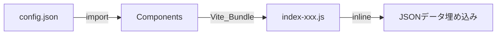
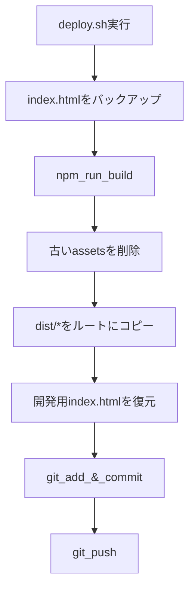

# ビルドフロー

## 概要

このプロジェクトはViteを使用してReactアプリケーションをビルドし、GitHub Pagesにデプロイします。

## ビルドプロセス

```mermaid
flowchart TD
    subgraph Development[開発環境]
        A[index.html] --> B[/src/main.tsx]
        B --> C[src/app/App.tsx]
        C --> D[Pages/Components]
        D --> E[src/data/config.json]
    end

    subgraph Build[ビルドプロセス]
        F[npm_run_build] --> G[Vite_Build]
        G --> H[TypeScript_Compile]
        H --> I[Bundle_&_Minify]
        I --> J[dist/フォルダ生成]
    end

    subgraph Output[ビルド出力]
        J --> K[dist/index.html]
        J --> L[dist/assets/index-xxx.js]
        J --> M[dist/assets/index-xxx.css]
    end

    Development --> Build
```

## データフロー



## ファイル構成

| ファイル                  | 用途                                              |
| ------------------------- | ------------------------------------------------- |
| `index.html`              | 開発用エントリーポイント（`/src/main.tsx`を参照） |
| `dist/index.html`         | 本番用HTML（ビルド済みアセットを参照）            |
| `dist/assets/index-*.js`  | バンドルされたJS（config.jsonのデータを含む）     |
| `dist/assets/index-*.css` | バンドルされたCSS                                 |

## デプロイフロー（deploy.sh）



## 重要な注意事項

### index.htmlの二重管理

- **開発用**: ルートの`index.html`は`/src/main.tsx`を参照
- **本番用**: `dist/index.html`はビルド済みアセットを参照

`deploy.sh`は開発用`index.html`を保護するため、デプロイ前にバックアップし、デプロイ後に復元します。

### config.jsonの反映確認

ビルド後、以下のコマンドでconfig.jsonのデータが正しく含まれているか確認できます：

```bash
# プロジェクト名で検索
grep -o "Slack Markdown Renderer" dist/assets/index-*.js

# 名前で検索
grep -o "Ryoichiro Teshima" dist/assets/index-*.js
```

## コマンドリファレンス

| コマンド                 | 説明                               |
| ------------------------ | ---------------------------------- |
| `npm run dev`            | 開発サーバー起動                   |
| `npm run build`          | 本番ビルド                         |
| `npm run preview`        | ビルド結果のプレビュー             |
| `./deploy.sh`            | ビルド＆デプロイ                   |
| `./scripts/dev-clean.sh` | キャッシュクリア＆開発サーバー起動 |
